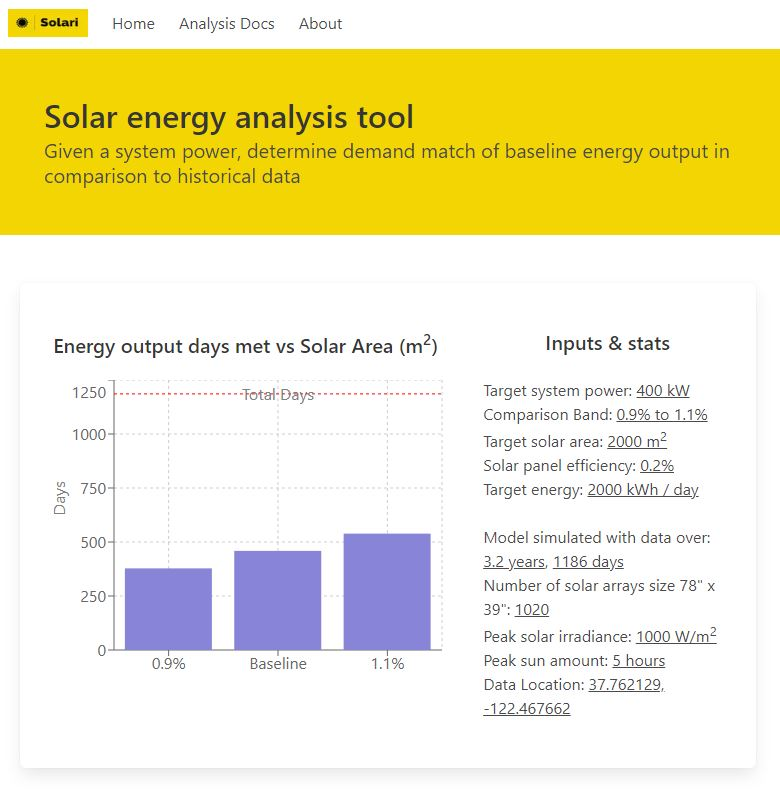

# Solari

This is a planning tool that simulates energy output of a solar energy project using historical data for 2020 to 2023 based in Inner Sunset neighborhood of San Francisco.

Live site here: [https://vercel.com/kevin-lambda/solar-anywhere-data](https://vercel.com/kevin-lambda/solar-anywhere-data)

## About

This project started as an effort to use solar data in a novel way. The goal is to solve a question or present data for a specific type of perspective. From that start, the function ended up being to project met or not met energy demand for a given solar project.

To get to v1.0, next steps for this project are to incorporate costs. Which would analyze the total costs of a solar project, potential PPA revenue, vs the losses when energy demand days are not met and must be purchased from the grid.

## Key Technology

- Next.js 13
- Bulma css
- recharts

## Acknowledgements

- [Solar Anywhere](https://www.solaranywhere.com/) public data (of [Clean Power Research](https://www.cleanpower.com/))

